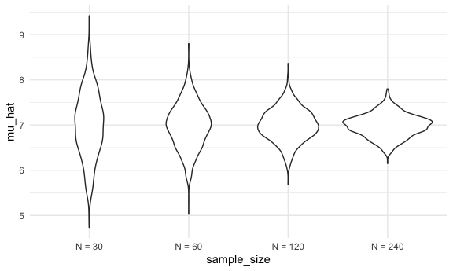
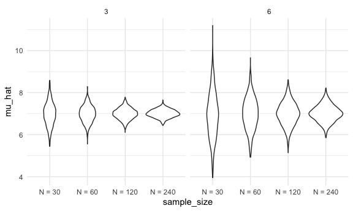

simulations
================
2022-11-06

# Simulations

Here is the function from before

``` r
sim_mean_sd = function(n_obs, mu = 7, sigma = 4){
  
  x = rnorm(n=n_obs,mean = mu, sd = sigma)

  
tibble(
    mu_hat = mean(x),
    sigma_hat = sd(x)
  )
}
```

How did we use it before?

``` r
sim_mean_sd(n_obs = 30)
```

    ## # A tibble: 1 × 2
    ##   mu_hat sigma_hat
    ##    <dbl>     <dbl>
    ## 1   7.15      5.35

How can we use this now

let’s start with a loop!

``` r
output = vector("list", length = 100)

for (i in 1:100){
  output[[i]] = sim_mean_sd(30)
}

bind_rows(output) %>% 
  view
```

let’s use list columns instead.

``` r
sim_results_df = 
  expand_grid(
    sample_size = 30,
    iteration = 1:100) %>%
  mutate(
    estimate_df = map(sample_size, sim_mean_sd)
  ) %>%
  unnest(estimate_df)
```

``` r
sim_results_df %>%
  ggplot(aes(x= mu_hat))+ 
  geom_density()
```


!!!!!!!!!!!!!

## What about changing the sample size?

I need a input list with lots of sample sizes

``` r
sim_results_df = 
  expand_grid(
    sample_size = c(30,60,120,240),
    iteration = 1:1000) %>%
  mutate(
    estimate_df = map(sample_size, sim_mean_sd)
  ) %>%
  unnest(estimate_df) 
```

``` r
sim_results_df %>%
  mutate(
    sample_size = str_c("N = ", sample_size),
    sample_size = fct_inorder(sample_size)
  ) %>%
  ggplot(aes(x= sample_size,y = mu_hat))+ 
  geom_violin()
```



``` r
sim_results_df %>%
  mutate(
    sample_size = str_c("N = ", sample_size),
    sample_size = fct_inorder(sample_size)
  ) %>%
  group_by(sample_size) %>%
  summarize(
    emp_st_err = sd(mu_hat)
  )
```

    ## # A tibble: 4 × 2
    ##   sample_size emp_st_err
    ##   <fct>            <dbl>
    ## 1 N = 30           0.737
    ## 2 N = 60           0.501
    ## 3 N = 120          0.359
    ## 4 N = 240          0.255

## let’s see two inputs…

``` r
sim_results_df = 
  expand_grid(
    sample_size = c(30,60,120,240),
    true_sigma = c(6,3),
    iteration = 1:1000) %>%
  mutate(
    estimate_df =
      map2(.x = sample_size, .y = true_sigma, ~sim_mean_sd(n_obs = .x, sigma = .y))
  ) %>%
  unnest(estimate_df) 
```

``` r
sim_results_df %>%
  mutate(
    sample_size = str_c("N = ", sample_size),
    sample_size = fct_inorder(sample_size)
  ) %>%
  ggplot(aes(x= sample_size,y = mu_hat))+ 
  geom_violin()+
  facet_grid(.~true_sigma)
```


